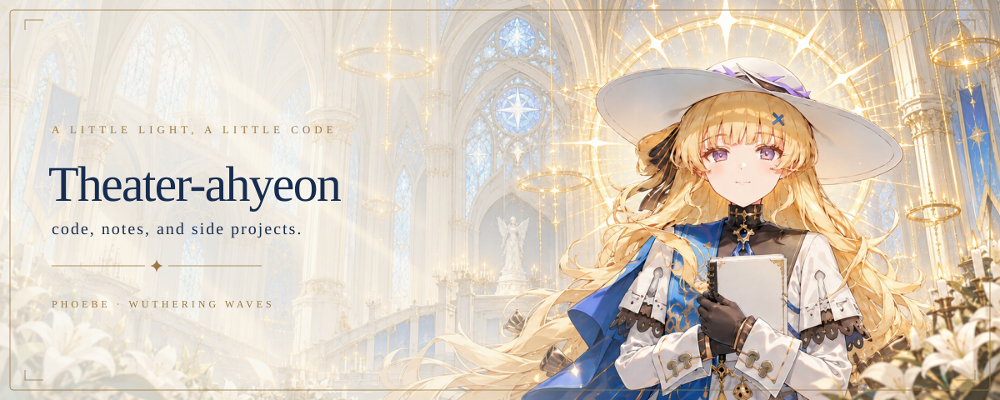
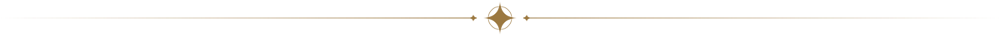
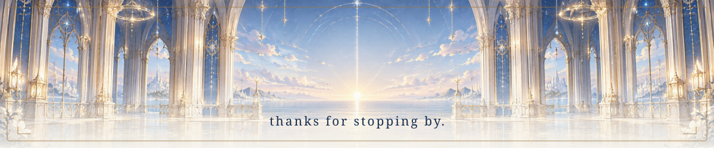

<picture>
  <source media="(prefers-color-scheme: dark)" srcset="assets/hero-dark.svg">
  <source media="(prefers-color-scheme: light)" srcset="assets/hero-light.svg">
  
</picture>

### ✎ about

- 🎓 Learning at **BUPT** · exploring computer science
- 🎧 Music, side projects, and a little curiosity
- 📫 [theater1347507191@163.com](mailto:theater1347507191@163.com)

<picture>
  <source media="(prefers-color-scheme: dark)" srcset="assets/divider-dark.svg">
  <source media="(prefers-color-scheme: light)" srcset="assets/divider-light.svg">
  
</picture>

### ▧ little progress

<picture>
  <source media="(prefers-color-scheme: dark)" srcset="https://raw.githubusercontent.com/Theater-ahyeon/Theater-ahyeon/output/stats-dark.svg">
  <source media="(prefers-color-scheme: light)" srcset="https://raw.githubusercontent.com/Theater-ahyeon/Theater-ahyeon/output/stats-light.svg">
  
</picture>
<picture>
  <source media="(prefers-color-scheme: dark)" srcset="https://raw.githubusercontent.com/Theater-ahyeon/Theater-ahyeon/output/streak-dark.svg">
  <source media="(prefers-color-scheme: light)" srcset="https://raw.githubusercontent.com/Theater-ahyeon/Theater-ahyeon/output/streak-light.svg">
  
</picture>

<picture>
  <source media="(prefers-color-scheme: dark)" srcset="https://raw.githubusercontent.com/Theater-ahyeon/Theater-ahyeon/output/snake-dark.svg">
  <source media="(prefers-color-scheme: light)" srcset="https://raw.githubusercontent.com/Theater-ahyeon/Theater-ahyeon/output/snake-light.svg">
  
</picture>

<picture>
  <source media="(prefers-color-scheme: dark)" srcset="assets/footer-dark.svg">
  <source media="(prefers-color-scheme: light)" srcset="assets/footer-light.svg">
  
</picture>

Phoebe · Wuthering Waves © KURO GAMES · AI-assisted fan art · <a href="DESIGN.md">credits</a>

