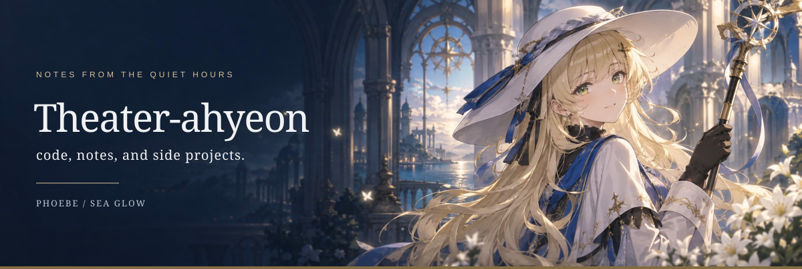

<picture>
  <source media="(prefers-color-scheme: dark)" srcset="assets/sea-glow/hero-dark.svg">
  <source media="(prefers-color-scheme: light)" srcset="assets/sea-glow/hero-light.svg">
  
</picture>

### ✎ about

- 🎓 Learning at **BUPT** · exploring computer science
- 🎧 Music, side projects, and a little curiosity
- 📫 [theater1347507191@163.com](mailto:theater1347507191@163.com)

<picture>
  <source media="(prefers-color-scheme: dark)" srcset="assets/sea-glow/divider-dark.svg">
  <source media="(prefers-color-scheme: light)" srcset="assets/sea-glow/divider-light.svg">
  
</picture>

### ▧ open-source notebook

<picture>
  <source media="(prefers-color-scheme: dark)" srcset="https://raw.githubusercontent.com/Theater-ahyeon/Theater-ahyeon/output/stats-sea-glow-dark.svg">
  <source media="(prefers-color-scheme: light)" srcset="https://raw.githubusercontent.com/Theater-ahyeon/Theater-ahyeon/output/stats-sea-glow-light.svg">
  
</picture>
<picture>
  <source media="(prefers-color-scheme: dark)" srcset="https://raw.githubusercontent.com/Theater-ahyeon/Theater-ahyeon/output/collaboration-sea-glow-dark.svg">
  <source media="(prefers-color-scheme: light)" srcset="https://raw.githubusercontent.com/Theater-ahyeon/Theater-ahyeon/output/collaboration-sea-glow-light.svg">
  
</picture>

<a href="https://github.com/search?q=is%3Apr+author%3ATheater-ahyeon+is%3Amerged+-user%3ATheater-ahyeon&amp;type=pullrequests">
<picture>
  <source media="(prefers-color-scheme: dark)" srcset="https://raw.githubusercontent.com/Theater-ahyeon/Theater-ahyeon/output/projects-sea-glow-dark.svg">
  <source media="(prefers-color-scheme: light)" srcset="https://raw.githubusercontent.com/Theater-ahyeon/Theater-ahyeon/output/projects-sea-glow-light.svg">
  
</picture>
</a>

**Selected merged PRs**

- **deer-flow** — [Scope delegation ledger IDs to parent runs #5898](https://github.com/bytedance/deer-flow/pull/5898) · [Terminalize batches after exhausted leases expire #5897](https://github.com/bytedance/deer-flow/pull/5897)
- **Octop** — [Checkpoint SQLite WAL before desktop restart #918](https://github.com/TencentCloud/Octop/pull/918)
- **crewAI** — [Fix run TUI crashes on literal streamed markup #7435](https://github.com/crewAIInc/crewAI/pull/7435)
- **Qwen Code** — [Document CI and release repository variables #11129](https://github.com/QwenLM/qwen-code/pull/11129)
- **Agno** — [Repair cookbook knowledge sources and documentation links #10160](https://github.com/agno-agi/agno/pull/10160)

<picture>
  <source media="(prefers-color-scheme: dark)" srcset="assets/sea-glow/footer-dark.svg">
  <source media="(prefers-color-scheme: light)" srcset="assets/sea-glow/footer-light.svg">
  
</picture>

Phoebe · Wuthering Waves © KURO GAMES · AI-assisted fan art · <a href="DESIGN.md">credits</a> · <a href="README.md">Sticker notebook theme</a>

